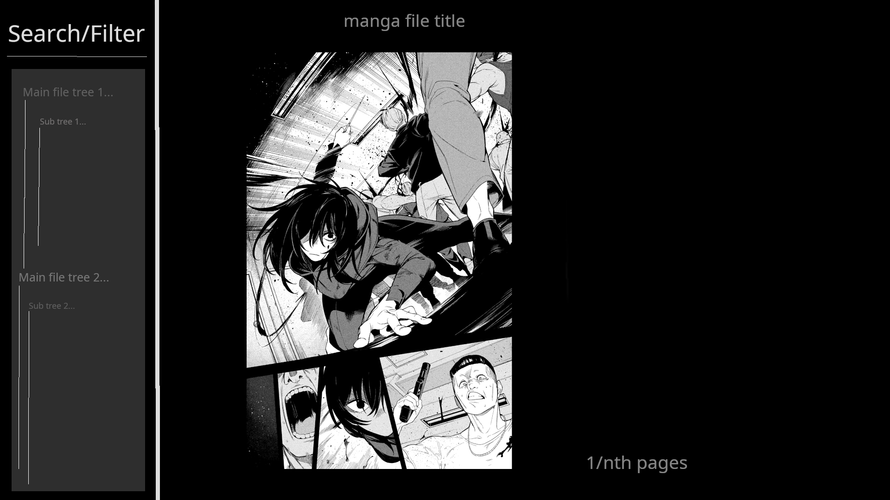

# Description
manga/comic reading apps for Linux are not the best the only good one is mangareader and I want to try my hand at crafting my very own for personal use.
this will be the start of a terminal based manga reader using golang+bubbletea. It will be built with two main functionalities in mind reading local manga owned and organizing personal library.

# TODO:
- [ ] implement search/filter component
- [ ] implement file tree/picker component
- [ ] research a new manga api database to fetch metadata 
- [ ] get familiar with the bubble tea framework: understand how to handle state, and also render app dimensions
- [ ] understand how we can render images on the terminal
- [ ] research alternative paths just incase tui idea is not possible with golang

# App desired functionality
App should allow for more than one filepath for local collection
- [ ] Search and filter local collection.
- [ ] store and track collection of personal library
- [ ] have collection separated by which filepath is imported
## Example
```
Main/file/path/tree1
├── series-subtree-1/
│   ├── somecbz1
│   ├── somecbz2
│   ├── somecbz3
├── series/subtree2/
│   ├── somecbz1
│   ├── somecbz2
│   ├── somecbz3

Main/file/path/tree2
├── series/subtree1/
│   ├── somecbz1
│   ├── somecbz2
│   ├── somecbz3
├── series/subtree2/
│   ├── somecbz1
│   ├── somecbz2
│   ├── somecbz3
```
- [ ] image rendering using kitty protocols
- [ ] if possible allow an image preview while selecting something to read

# Prototype Visualization

